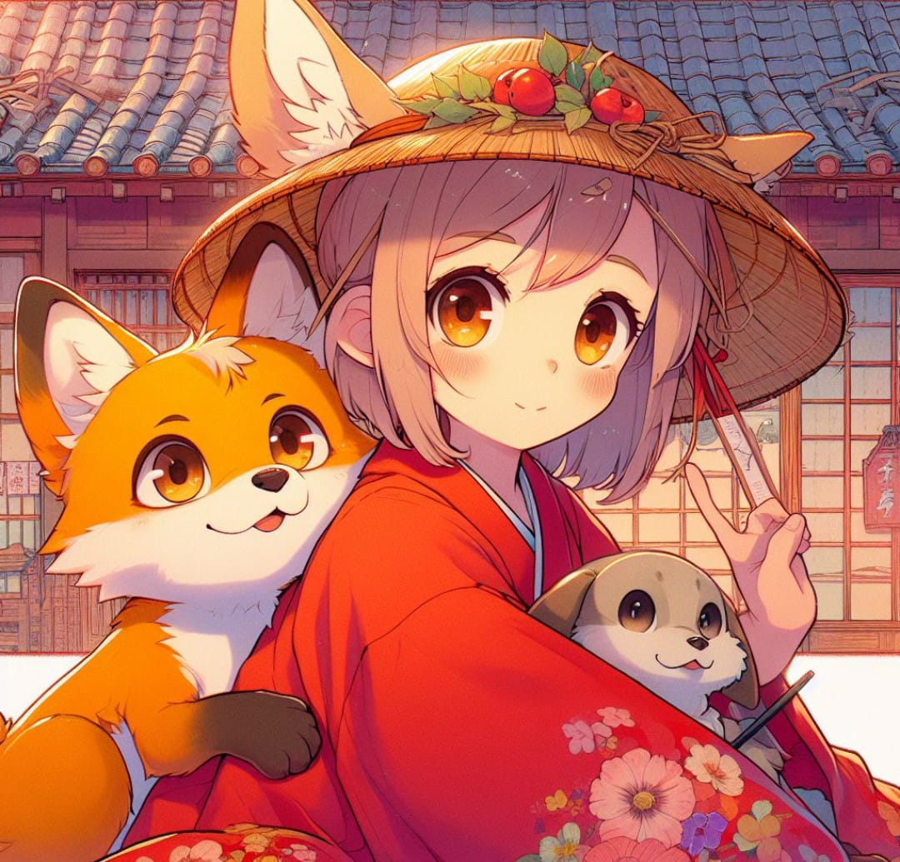

    

-------

# Projeto EBOOK Gerado por I.A.s

Projeto com o objetivo de gerar um ebook digital com as facilidades das ferramentas de IA. todos os prompts
seguem abaixo.

<a href="file:///C:/Users/rosan/OneDrive/%C3%81rea%20de%20Trabalho/Ebook.pdf"> 

## 💻 Tecnologias utilizadas no projeto

- [ChatGPT](https://chat.openai.com/) 
- [Copilot](https://www.microsoft.com/app/)
- [PowerPoint](https://www.microsoft.com/en/microsoft-365/powerpoint)

## 🧠 Prompts

ChatGPT：

|   Ação   | prompt                                                                                                                                                                                                                                                                         |
| :------: | ------------------------------------------------------------------------------------------------------------------------------------------------------------------------------------------------------------------------------------------------------------------------------ |
Criei um ebook com o tema The Fox and the Hound: Anime Live-Action, em dois idiomas (inglês e português), inspirado no desenho da Disney O cão e a raposa.                                               |

Copilot：

|  Ação  | prompt                                                                                 |
| :----: | -------------------------------------------------------------------------------------- |
| Criação da capa e das imagens. |

## ✨ Features

- Conteúdo gerado via ChatGPT.
- Imagens geradas via Copilot.
- Logo salvo via Pinterest.
- Criação via PowerPoint. 

## 📚 Materiais

- Imagens utilizadas em `assets`
- ebook gerado durante as aulas em `output`

---
[Rosana TSF] (https://github.com/RosanaTSF)
